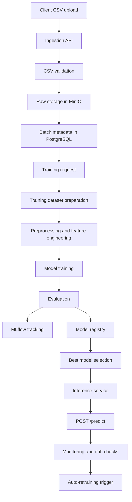

# fraud-detection-mlops-platform

Distributed MLOps platform for fraud detection on tabular transaction data, covering raw data ingestion, training dataset preparation, model training and registry, experiment tracking with MLflow, asynchronous orchestration, inference serving, monitoring, drift detection, and auto-retraining.

## Overview

This project is designed as an end-to-end MLOps platform for a fraud detection use case. Instead of treating model training as a standalone notebook task, the repository organizes the full ML lifecycle into platform layers:

- data ingestion and raw storage;
- metadata tracking in PostgreSQL;
- training dataset preparation from versioned raw batches;
- model training and evaluation;
- model registry and artifact versioning;
- MLflow experiment tracking;
- asynchronous training orchestration;
- online inference service;
- monitoring, drift checks, and retraining triggers.

The platform is built around containerized services and is intended to be run locally through Docker Compose as a lightweight distributed system.

## Project goal

The main goal of the project is to provide a reproducible and extensible fraud detection platform that can:

- accept transaction datasets from clients;
- validate and persist raw data safely;
- prepare consistent train and validation datasets;
- train and evaluate baseline fraud models;
- version and register trained models;
- expose an inference API for online scoring;
- detect data drift and quality degradation;
- trigger retraining when conditions require it.

## What problem it solves

Fraud detection systems usually need more than just a model. In practice, teams need a platform that handles:

- raw data delivery;
- dataset lineage;
- reproducible training runs;
- artifact storage;
- model version control;
- inference deployment;
- operational monitoring.

This repository is structured exactly around that idea: a small but realistic MLOps platform for the fraud detection lifecycle.

## Architecture



## Platform layers

### 1. Ingestion layer

The ingestion layer is responsible for accepting raw CSV files and registering them as versioned batches.

Core responsibilities:

- accept CSV uploads through `POST /ingest`;
- validate file structure and required columns;
- store raw data in MinIO;
- save batch metadata in PostgreSQL;
- return batch identifiers and storage paths.

This layer intentionally does not perform heavy preprocessing. Raw data remains raw, while downstream services build training-ready datasets separately.

### 2. Training dataset layer

The dataset preparation layer loads one uploaded raw batch and transforms it into a training-ready fraud detection dataset.

Core responsibilities:

- load a selected raw CSV from MinIO;
- resolve the correct batch through metadata;
- select features and target;
- create engineered balance-based features;
- split into train and validation with stratification;
- return both processed data and metadata suitable for experiment logging.

This separation between raw layer and training layer is one of the key design decisions in the project.

### 3. Training and evaluation layer

The training layer is responsible for fitting a baseline fraud detection model and computing the right evaluation metrics.

Expected responsibilities across the training flow:

- baseline model training for binary classification;
- reproducible hyperparameter handling;
- calculation of fraud-relevant metrics such as:
  - `ROC-AUC`
  - `Precision`
  - `Recall`
  - `F1-score`
  - optionally `PR-AUC`
- serialization of model and preprocessing artifacts;
- registration of model versions.

For fraud detection, the project explicitly treats `accuracy` as insufficient and focuses on imbalance-aware metrics.

### 4. MLflow tracking layer

The project also includes an MLflow layer on top of the training stack.

MLflow is used for:

- logging hyperparameters;
- logging dataset metadata;
- logging training and validation metrics;
- storing model artifacts;
- comparing training runs;
- linking registry entries to experiment runs.

Important design choice:

- PostgreSQL and MinIO remain the operational storage backbone;
- MLflow is added as an experiment tracking and artifact logging layer, not as a replacement for ingestion or registry logic.

### 5. Orchestration layer

The final platform design introduces asynchronous orchestration for heavy ML tasks.

Expected responsibilities:

- receive training requests without blocking the API;
- enqueue training jobs;
- execute training and retraining through workers;
- track job state transitions;
- publish platform events through a broker.

This allows the platform to move from a synchronous demo service to a more realistic distributed MLOps system.

### 6. Inference layer

The inference layer is responsible for serving the currently best fraud model.

Core responsibilities:

- load the best registered model;
- load the compatible preprocessing artifact;
- validate incoming transaction payloads;
- return fraud prediction, probability/score, and model version.

This layer is designed as a standalone service, separated from the training environment.

### 7. Monitoring and retraining layer

The last platform layer closes the loop.

Expected responsibilities:

- expose service and ML metrics;
- track model behavior in production;
- detect drift and quality degradation;
- trigger retraining when defined rules are met;
- support observability through Prometheus and distributed tracing.

## Sprint progression

The project is naturally structured through three sprints plus an MLflow extension.

### Sprint 1 — Data ingestion and raw storage

Delivered layer:

- Dockerized ingestion setup;
- PostgreSQL + MinIO + ingestion service;
- CSV validation;
- raw file storage in object storage;
- batch metadata persistence;
- `POST /ingest` endpoint.

### Sprint 2 — Training and model registry

Delivered layer:

- training dataset preparation from raw batches;
- baseline fraud model training;
- evaluation metrics for imbalanced binary classification;
- model registry and artifact versioning;
- `POST /train` training flow;
- MLflow tracking integration.

### Sprint 3 — Distributed orchestration and inference

Delivered layer:

- message broker and async execution model;
- worker-based training jobs;
- job tracking;
- standalone inference service;
- `POST /predict` endpoint;
- monitoring, drift detection, and retraining triggers.

### MLflow extension

The MLflow addition complements Sprint 1 and Sprint 2 by adding:

- experiment tracking;
- metrics logging;
- artifact logging into MinIO-backed storage;
- links between registry entries and MLflow runs.

## Current repository structure

Based on the current codebase, the repository already follows a layered application layout.

```text
fraud-detection-mlops-platform/
├── README.md
├── Dockerfile
├── docker-compose.yml
├── .env
├── .env.example
├── app/
│   ├── main.py
│   ├── config.py
│   ├── db.py
│   ├── models.py
│   ├── schemas.py
│   ├── api/
│   │   └── ingest.py
│   └── services/
│       ├── validation.py
│       ├── storage.py
│       ├── metadata.py
│       └── dataset.py
└── descriptions/
    ├── ingest.txt
    ├── validation.txt
    ├── storage.txt
    ├── metadata.txt
    ├── dataset.txt
    └── docker.txt
```

## What each module does

### `app/main.py`

Application entrypoint:

- creates the FastAPI app;
- initializes database tables on startup;
- checks PostgreSQL connectivity;
- registers API routers;
- exposes a simple `/health` endpoint.

### `app/config.py`

Loads configuration from environment variables and builds a database URL through `pydantic-settings`.

### `app/db.py`

Database layer:

- creates the SQLAlchemy engine;
- defines the declarative base;
- provides session dependency;
- exposes database health checking.

### `app/models.py`

Contains ORM models for batch metadata.

### `app/schemas.py`

Contains Pydantic request/response schemas for ingestion metadata.

### `app/api/ingest.py`

Implements `POST /ingest` as an orchestration endpoint that:

- receives the uploaded file;
- validates it;
- uploads it to MinIO;
- saves metadata in PostgreSQL;
- returns batch-level response data.

### `app/services/validation.py`

Implements a compact but strict CSV validator for the fraud dataset.

Validation includes:

- required columns;
- non-empty dataset;
- non-empty critical columns;
- expected numeric, string, and binary value types.

### `app/services/storage.py`

Handles MinIO object storage:

- creates the client from environment variables;
- creates the bucket if needed;
- builds client-specific object paths;
- uploads raw CSV files;
- returns `s3://...` storage paths.

### `app/services/metadata.py`

Stores metadata for uploaded batches in PostgreSQL using SQLAlchemy ORM.

### `app/services/dataset.py`

Implements the training dataset layer:

- resolves a raw batch from metadata;
- downloads CSV from storage;
- builds baseline features and engineered balance-based features;
- performs train/validation split;
- fits preprocessing;
- returns processed datasets plus logging metadata.

## Dataset assumptions

The ingestion and training flow are built around a fraud detection transaction dataset with columns such as:

- `step`
- `type`
- `amount`
- `nameOrig`
- `oldbalanceOrg`
- `newbalanceOrig`
- `nameDest`
- `oldbalanceDest`
- `newbalanceDest`
- `isFraud`
- `isFlaggedFraud`

The project is therefore aligned with PaySim-style fraud detection data and baseline tabular ML pipelines.

## Technology stack

The project uses a practical MLOps stack built around familiar tools:

- `Python`
- `FastAPI`
- `SQLAlchemy`
- `PostgreSQL`
- `MinIO`
- `Pandas`
- `scikit-learn`
- `Docker` and `Docker Compose`
- `MLflow`
- `Celery` and message broker layer for async orchestration
- `Prometheus` and `Jaeger` for observability in the full target architecture

## Why this project is strong

This repository is valuable because it is not only about model training. It is about building a realistic platform around the model.

It demonstrates:

- separation of raw data ingestion from training preparation;
- object storage plus relational metadata tracking;
- dataset lineage and versioning;
- containerized service architecture;
- experiment tracking through MLflow;
- the full path from uploaded data to deployed fraud model;
- MLOps thinking rather than notebook-only ML work.

## Running the platform

At the infrastructure level, the platform is designed to run through Docker Compose.

Typical workflow:

1. configure environment variables in `.env`
2. build and start services:

```bash
docker compose up --build
```

3. verify the service health:

```bash
GET /health
```

4. upload a dataset batch through:

```bash
POST /ingest
```

In the full project flow, the next steps are:

- trigger training;
- inspect MLflow runs;
- register and promote the best model;
- serve predictions through the inference service.

## Recommended future structure expansion

As the repository grows toward the full Sprint 3 architecture, the natural next additions are:

- `app/api/train.py`
- `app/api/predict.py`
- `app/api/jobs.py`
- `app/services/training.py`
- `app/services/evaluation.py`
- `app/services/registry.py`
- `app/services/mlflow_tracking.py`
- `app/services/monitoring.py`
- `app/services/drift.py`
- `worker/` or `tasks/` for Celery-based asynchronous execution
- `inference_service/` if serving is separated into its own deployable module

## Short summary

`fraud-detection-mlops-platform` is a compact but realistic distributed MLOps project for fraud detection. It combines ingestion, storage, metadata tracking, dataset preparation, model lifecycle management, tracking, orchestration, and serving into a single platform-oriented architecture.

It is best understood not as “just an API” and not as “just a fraud model,” but as a full engineering project around the lifecycle of an ML fraud detection system.
